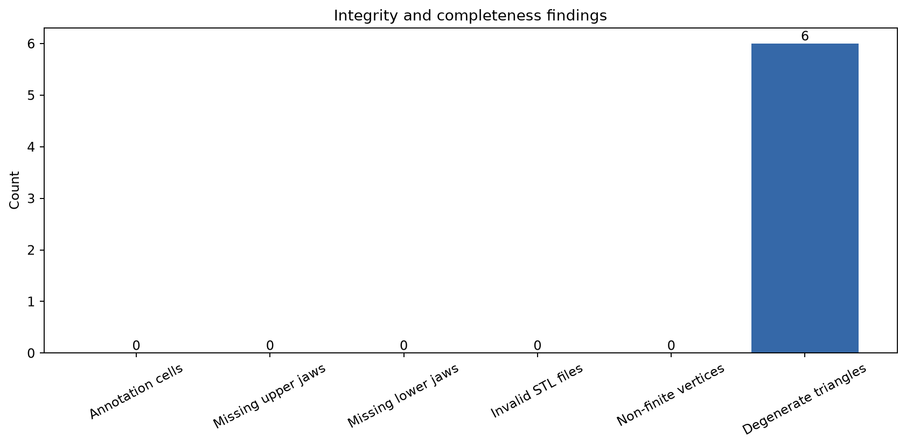
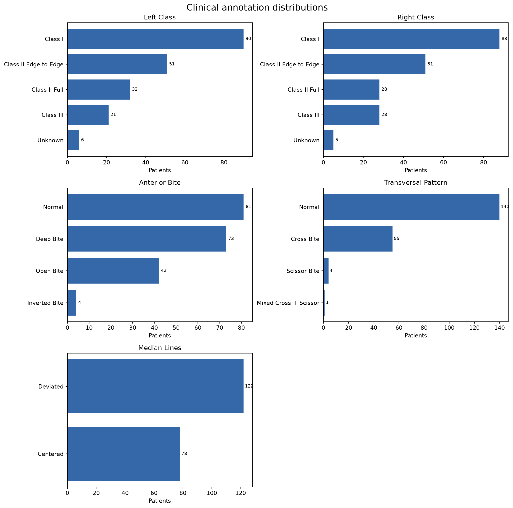
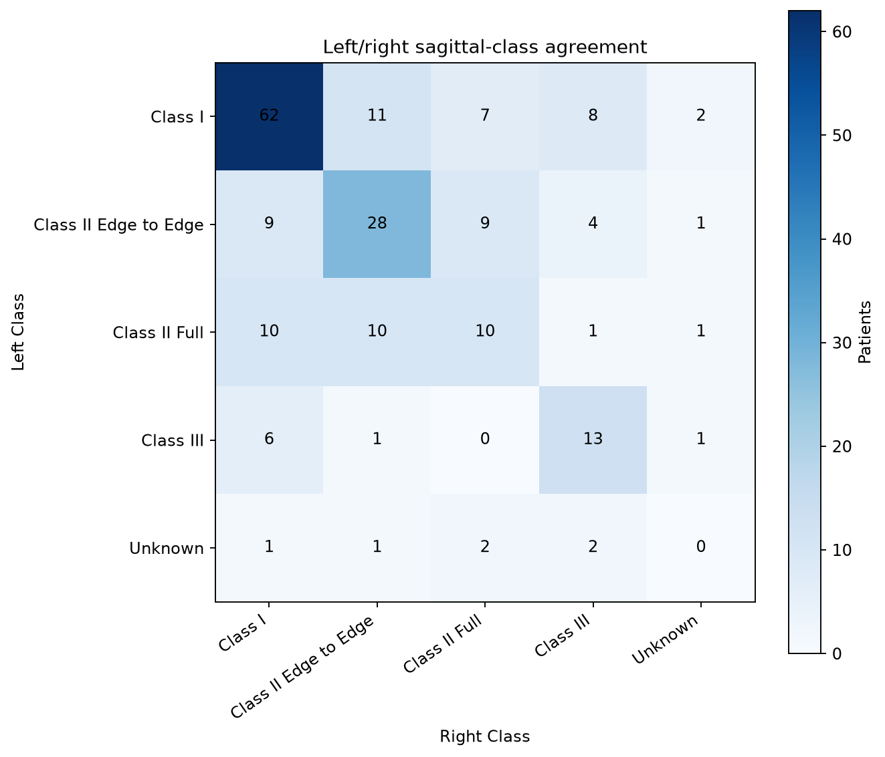
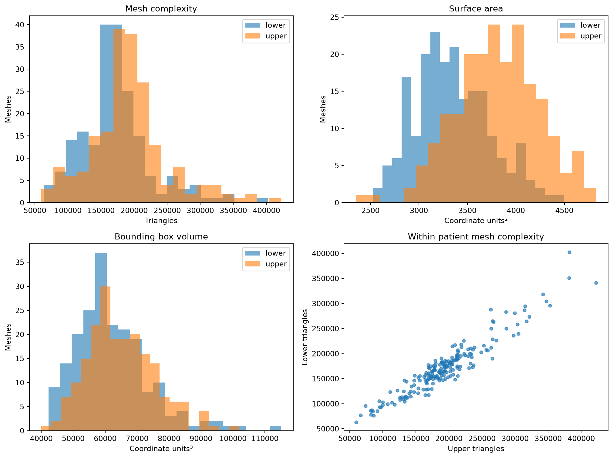
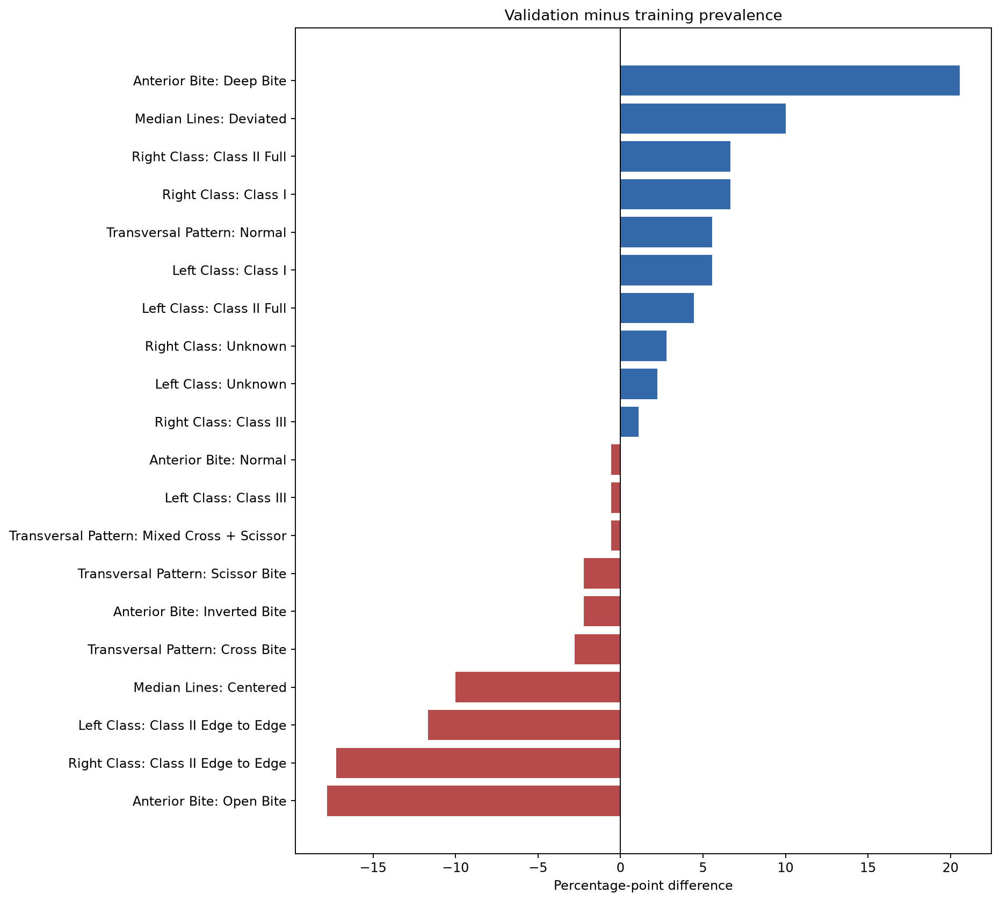

# Bits2Bites v01 — Complete Data Audit

**Audit date:** 2026-08-16  
**Source:** `Bits2Bites_v01.zip`  
**Scope:** all 200 patients, 400 STL files, and every annotation cell  
**Privacy:** aggregate statistics only; no patient geometry, identifiers, or row-level clinical annotations are reproduced.

## Executive summary

The supplied archive is **Bits2Bites**, not the Bite2Text multimodal reporting dataset described elsewhere in this repository. It contains only paired upper/lower 3D dental scans and categorical occlusion annotations—no intraoral photographs and no free-text reports. It therefore cannot directly train or audit a Bite2Text report-generation model.

The archive is structurally complete: 200 annotation rows correspond one-to-one with 200 mesh case folders, split into 180 training and 20 validation patients. Every patient has an upper and lower STL. All 400 binary STL files passed byte-layout and finite-coordinate validation. There are 0 missing annotation cells, 0 invalid meshes, 6 zero-area triangles across 2 meshes, and 0 exact duplicate mesh hash groups.

The main modeling risks are categorical imbalance, a small validation cohort (10%), and visible train–validation prevalence shifts for some clinical subclasses. Evaluation and model selection should use macro-averaged per-target metrics in addition to overall accuracy.

## Dataset inventory

| Item | Result |
|---|---:|
| Patients | 200 |
| Training patients | 180 |
| Validation patients | 20 |
| Upper meshes | 200 |
| Lower meshes | 200 |
| Extracted bytes | 3,648,941,430 |
| Annotation targets | 5 |
| Missing annotation cells | 0 |
| Invalid meshes | 0 |
| Exact duplicate mesh groups | 0 |



## Clinical labels

The CSV provides bilateral sagittal classes and three additional occlusal findings. For visualization, the raw transversal descriptions are parsed into Normal, Cross Bite, Scissor Bite, or Mixed while tooth-level detail is retained separately. Aggregate counts are:

- **Left Class:** Class I: 90, Class II Edge to Edge: 51, Class II Full: 32, Class III: 21, Unknown: 6
- **Right Class:** Class I: 88, Class II Edge to Edge: 51, Class II Full: 28, Class III: 28, Unknown: 5
- **Anterior Bite:** Normal: 81, Deep Bite: 73, Open Bite: 42, Inverted Bite: 4
- **Transversal Pattern:** Normal: 140, Cross Bite: 55, Scissor Bite: 4, Mixed Cross + Scissor: 1
- **Median Lines:** Deviated: 122, Centered: 78



### Annotation schema findings

- `Transversal Bite` has **54 unique raw strings** because condition type and involved teeth share one field.
- **15 rows** use abbreviated `Cross ...` rather than `Cross Bite ...` wording.
- Tooth tokens outside the expected permanent FDI ranges 11–18 and 21–28: **222**.
- Preserve the raw field for traceability, but train on an explicitly versioned parser that separates condition type, side/tooth involvement, and malformed/unknown status. Any suspected typo must be clinically adjudicated rather than silently corrected.

Left and right sagittal labels agree exactly for **56.5%** of patients. This dependence means treating the two sides as independent samples would inflate the effective sample size and leak patient information. A shared encoder with separate side-specific heads is a more defensible formulation.



## 3D mesh audit

Every STL was checked independently for binary-STL byte consistency, finite coordinates, triangle count, zero-area triangles, bounding-box extents, approximate surface area, and SHA-256 identity. Coordinate units are not asserted in the archive metadata, so area and volume are reported as coordinate units rather than assumed millimeters.

| jaw | bytes min | bytes median | bytes max | triangles min | triangles median | triangles max | surface_area min | surface_area median | surface_area max | bbox_volume min | bbox_volume median | bbox_volume max | extent_x min | extent_x median | extent_x max | extent_y min | extent_y median | extent_y max | extent_z min | extent_z median | extent_z max |
|---|---|---|---|---|---|---|---|---|---|---|---|---|---|---|---|---|---|---|---|---|---|
| lower | 3158584.00 | 8379409.00 | 20115584.00 | 63170.00 | 167586.50 | 402310.00 | 2526.01 | 3304.79 | 4495.80 | 42270.49 | 60035.56 | 115127.66 | 58.00 | 67.40 | 82.88 | 38.99 | 51.36 | 67.25 | 14.59 | 17.26 | 25.57 |
| upper | 2985984.00 | 9453734.00 | 21118784.00 | 59718.00 | 189073.00 | 422374.00 | 2351.89 | 3818.33 | 4827.17 | 40002.64 | 63696.78 | 101775.59 | 53.58 | 64.00 | 76.51 | 36.87 | 55.50 | 69.65 | 14.30 | 17.98 | 30.21 |

Upper and lower triangle counts have Pearson correlation **0.950** within patients. The distributions show heterogeneous mesh resolution, so models should resample to a fixed point/face budget and retain the original scale only after confirming the coordinate-unit convention.



## Split analysis

The provided split is patient-disjoint by folder ID: 180 train and 20 validation cases. The plot below reports validation prevalence minus training prevalence for every class. Large bars should be treated cautiously because each validation patient changes prevalence by five percentage points.



Recommendations:

1. Preserve the official validation split for comparable experiments, but report repeated patient-level cross-validation on the 180 training cases for uncertainty estimates.
2. Use stratified multilabel/group-aware folds where possible; never split upper and lower jaws independently.
3. Report macro-F1 and balanced accuracy for each target, per-class recall, and exact-match accuracy across all five targets.
4. Fit geometry normalization, augmentation statistics, class weights, and any learned preprocessing on training patients only.
5. Inspect outlier scales in the authorized environment before choosing global centering/scaling. Avoid publishing identifiable mesh renders.

## End-to-end modeling blueprint

1. **Ingest:** validate case-to-annotation joins and both jaw files using the checks above.
2. **Preprocess:** orient consistently, center using a documented anatomical or bounding-box reference, preserve relative upper/lower pose, and sample fixed-size point clouds or meshes.
3. **Represent:** encode upper and lower jaws with shared 3D backbones; fuse jaw embeddings and explicit relative-pose features.
4. **Predict:** use five task heads, with separate left/right sagittal outputs and independent heads for anterior, transversal, and median-line findings.
5. **Train:** class-balanced loss, patient-level sampling, seeded augmentation, early stopping on macro validation performance, and calibration monitoring.
6. **Evaluate:** compare majority-class, geometry-only, and fused-jaw baselines; provide bootstrap confidence intervals and per-class confusion matrices.
7. **Package:** freeze preprocessing with the checkpoint, validate all expected patient outputs, record code/data hashes, and keep raw clinical data outside Git.

## Reproducibility artifacts

- `scripts/analyze_bits2bites.py`: complete rerunnable audit.
- `docs/assets/data_audit/mesh_metrics.csv`: per-mesh technical metrics with dataset-relative paths.
- `docs/assets/data_audit/label_counts.json`: aggregate label counts.
- `docs/assets/data_audit/summary.json`: machine-readable headline findings.
- PNG files in `docs/assets/data_audit/`: aggregate visualizations embedded above.

Re-run from the repository root with:

```bash
python scripts/analyze_bits2bites.py --root data/raw/bits2bites_v01 --report DATA_AUDIT.md
```

## Limitations

- This is a structural/statistical audit, not clinical adjudication of label correctness.
- STL coordinate units, scan hardware, acquisition center, demographic attributes, and annotation-rater metadata are not present in the supplied archive.
- With only 20 validation cases, apparent subgroup differences have high sampling uncertainty.
- Exact hashing detects byte-identical meshes but not geometrically equivalent rescans or transformed near-duplicates.
- No test split is present in this archive.
